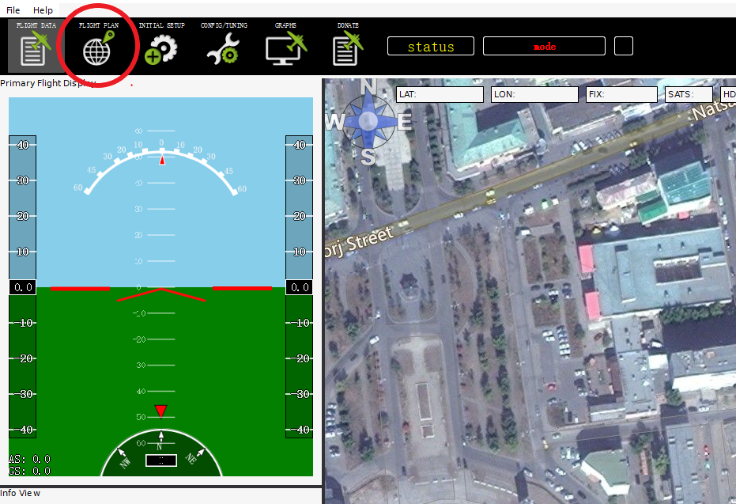

组装一架满足编队需求的飞机
==========================

系统需求
--------

无人机
~~~~~~

1．使用Pixhawk作为其飞行控制器的无人机。

2．一个微型车载Linux计算机。(例如:树莓派)

3．带有USB适配器的XBee模块。(例如:XBee S1, XBee S2C，等等)

4．(可选)用于调试的USB- ttl适配器(例如FT232,
CP2102/CP2104，不使用PL2303) 示例:XBee模块通过USB连接到RPi,
RPi通过UART连接到Pixhawk。在Rpi上配置硬件UART，使其运行在921600bps
波特率，与Pixhawk系列的设置一致。(http://ardupilot.org/dev/docs/partner-computers.html)

地面控制站
~~~~~~~~~~

1．一个Linux计算机。(虚拟机也可以)

2．带有USB适配器的XBee模块。(如XBee S1, XBee S2C等)
通常一个多旋翼组成包括以下硬件（四轴）：

.. figure:: picture1.png
   :alt: 

一个四轴飞行器的构成：
~~~~~~~~~~~~~~~~~~~~~~

1.  四轴机架 X1（必须）

2.  动力马达 X4 （必须）

3.  无刷电子调速器（电调/ESC）X4 （必须）

4.  PixhACK v3 飞控 X1 （必须）

5.  CUAV GPS X1 （必须）

6.  无线数传 (CUAV RADIO/XBEE/XTEND/HACKLINK/WP-LINK） X1对 （必须）

7.  动力电池（必须）

8.  RC遥控器和RC接收机（必须）

9.  无刷云台或者相机（可选）

10. 超声波或者激光传感器（可选）

11. 光流定点传感器（可选）

.. figure:: picture2.jpg
   :alt: 

.. figure:: picture3.jpg
   :alt: 

支持电池类型
~~~~~~~~~~~~

使用标配的CUAV IV模块，支持标准2-6V动力电池

IV模块支持2-6V电压、0-60A电流 实时监测

理论上：

需要实时控制能飞行的高度和距离:跟动力续航时间、遥控器或者数传通讯距离有关

自主飞行的高度和距离：跟动力、续航时间有关

PixHack飞控板设备接线定义
~~~~~~~~~~~~~~~~~~~~~~~~~

每种飞行器的电动机顺序 (里边的数字对应的飞控板的PWM输出端口)

CW 顺时针螺旋桨，绿色图示

CCW逆时针螺旋桨 ，蓝色图示

注意：错误的接线和固件，都会导致起飞就翻车，或者严重往一边倾斜，需要谨慎安装和选择固件
|image0|

四轴飞行器：
~~~~~~~~~~~~

.. figure:: picture5.png
   :alt: 

这种H型机架，应该配置X型模式

.. figure:: picture6.png
   :alt: 

软件及嵌入式系统配置
====================

飞控的Telem2接口与RaspberryPI的UART通过3-pin twisted
cable连接，RaspberryPI与XBee(本项目采用XBee pro s1)通过USB
cable相连。为了使三者能够正常通信，须按照以下步骤进行配置。

RaspberryPI配置参考
-------------------

1. 树莓派操作系统(注:本项目采用带有图形界面的Ubuntu MATE 16.04 for RaspberryPI 3B，其他的OS配置方法可能不同)
~~~~~~~~~~~~~~~~~~~~~~~~~~~~~~~~~~~~~~~~~~~~~~~~~~~~~~~~~~~~~~~~~~~~~~~~~~~~~~~~~~~~~~~~~~~~~~~~~~~~~~~~~~~~

1) SD卡格式化软件SD Formatter 4.0 for SD/SDHC/SDXC

2) 系统镜像文件在Ubuntu mate官网上下载，写入SD卡的软件Win32 Disk Imager

3) 安装操作系统时，勾选开机自动登录。(实现auto-login)

4) 操作系统安装完成以后，下载文本编辑器gedit，方便后续更改配置文件。
   sudo apt install gedit

2. 将UART启用为communication interface。
~~~~~~~~~~~~~~~~~~~~~~~~~~~~~~~~~~~~~~~~

1) sudo gedit /boot/cmdline.text

2) 删除语句‘console=serial0,115200’保存并退出。 ### 3.
   修改UART配置，关闭蓝牙（注:mate系统默认蓝牙占用UART）

3) sudo gedit /boot/config.txt

4) 修改init\_uart\_clock to 16MHz以及init\_uart\_baudrate to
   921600并删除语句前面的注释符号#。（注:飞控Telem2波特率也要相应地修改为921600）

5) 在文本下面添加语句‘core\_freq = 250’

6) 在文本下面添加语句‘dtoverlay=pi3-disable-bt’保存并退出

7) sudo systemctl disable hciuart sudo reboot

重启后UART配置完成

4. 安装Python包和Linux包。（注:mate系统自带python 2.7环境）
~~~~~~~~~~~~~~~~~~~~~~~~~~~~~~~~~~~~~~~~~~~~~~~~~~~~~~~~~~~

1) sudo apt install python-pip python-dev sudo pip install pip dronekit
   xbee numpy gps pyzmq –-upgrade

2) sudo apt install python-serial

5. 开启ssh。
~~~~~~~~~~~~

1) sudo apt install openssh-server openssh-client

2) sudo raspi-cofig

3) 出现配置界面，选择‘network’。

4) 选择‘ssh enabled’。 ### 6. 设置开机自启程序。(确保auto-login已实现)

5) sudo gedit /etc/rc.local

6) 在文件中添加 cd /AmazeFly python onboard.py -xbee /dev/ttyUSB –pix
   /dev/ttyAMA0，保存退出

XBee配置参考
------------

1. 固件烧写
~~~~~~~~~~~

1) 下载工具XCTU

2) 烧写DigiMesh固件(注:推荐8073 – Xbee DiGiMesh 2.4)

2. 将配置文件导入XBee
~~~~~~~~~~~~~~~~~~~~~

编队程序解析
============

1.介绍
~~~~~~

AmazeFly的无人机采用\ `Pixhawk <https://pixhawk.org>`__\ 和\ `ArduPilot <https://www.ardupilot.org>`__\ 堆栈作为它们的低级飞行控制器，并使用\ `dronekit-python <python.dronekit.io>`__\ 作为高级应用程序控制。到目前为止还没有在Pixhawk和ArduPilot级别进行修改，所以这个项目完全是用Python编写的，运行在Linux环境下(例如Raspberry
Pi)。

AMazeFly的无人机使用\ `XBee <https://www.digi.com/products/xbee-rf-solutions/2-4-ghz-modules>`__\ 模块在无人机和地面控制站之间建立高层通信网络。

1.1引用
^^^^^^^
Quan Yuan,Flydan项目(https://github.com/WeskerYuan/flydan)

1.2许可
^^^^^^^

AmazeFly项目是Apache 2.0下提供的开源许可。

1.3编码规范
^^^^^^^^^^^

项目完全是按照\ `谷歌Python风格指南 <https://google.github.io/styleguide/pyguide.html>`__\ 的约定用Python
2.7编写的。

--------------

2.项目的主要组成部分
~~~~~~~~~~~~~~~~~~~~

|image1|
gcs.py:
^^^^^^^

用于四轴飞行器集群控制实验的地面控制站脚本。

该脚本在装有Linux
的笔记本电脑上运行。该过程应连接一个高级XBee模块，用于无人机和地面控制站之间的相互通信。XBee模块运行在API2，转义字符模式。在编写时，应使用XBee
Pro S1模块（使用DIJI
Mesh固件）。有关更多详细信息，请参阅DIJI官方网站和数据表。目前，dronekit
API包支持Python
2.7。然而，Ubuntu是更好的选择，因为它使用‘apt’方式来获得分布式包。

onboard.py:
^^^^^^^^^^^

这是四轴飞行器集群控制实验的主要脚本。

该脚本在板载配套计算机（例如Raspberry Pi）上运行。与此同时，
控制通过USB或串行连接，按照MAVLink协议执行。无人驾驶飞机和地面控制站之间，应连接高级XBee模块以进行相互通信。XBee模块在API2，转义字符模式下运行。在编写时，应使用XBee
Pro S1模块（使用DIJI
Mesh固件）。有关更多详细信息，请参阅DIJI官方网站和数据表。目前，dronekit
API包支持Python
2.7。然而，Ubuntu是更好的选择，因为它使用‘apt’方式来获得分布式包。

comm.py：
^^^^^^^^^

通信的类和函数。

该模块包含用于车辆或车辆和GCS之间通信的类和函数。通常，使用XBee模块让车辆交换信息。

mas.py：
^^^^^^^^

多代理系统控制算法模块。

此模块包含高级代理系统控制的类和函数。这有两种主要的集群控制算法：
2014年COLLMOT的自动推进算法和2016年的RCSNS的分散式模型预测控制。

nav.py：
^^^^^^^^

导航功能。

该模块包含基本的直升机导航功能，这些功能大部分处于GUIDED模式。这些代码是参考Dronekit组编写的导航功能，借鉴修改来的。

shared.py：
^^^^^^^^^^^

跨文件共享的模块。

该模块包含许多不同的全局共享文件功能。它们是常量或预定义对象，具体取决于具体情况。某些属性在程序启动时被加载或实例化，并且在整个运行过程中都认为是常量。详细说明请参阅源代码注释。

util.py：
^^^^^^^^^

实用功能。

该模块具有几个有用的功能，便于矢量计算和数据日志记录。大多数函数可以直接使用而不需要其他模块。

missionparser.py：
^^^^^^^^^^^^^^^^^^

上传任务。

PWMController.py：
^^^^^^^^^^^^^^^^^^

打开或关闭无人机上的LED。

Mission\_txt： 存放任务的目录。

3.主要步骤
~~~~~~~~~~

1.建立一个飞行任务，并将生成的任务TXT文件复制到无人机项目中。

2.运行onboard.py文件。

3.在Linux计算机运行gcs.py文件并控制无人机。

4.如何使用
~~~~~~~~~~

1.建立一个飞行任务:
^^^^^^^^^^^^^^^^^^^

软件:APM Planner 2.0

步骤:

(1)运行该软件。

(2)单击“FLIGHT PLAN”。

(3)双击地图上的一个点(编号为0)作为“飞行原点”。

.. figure:: picture9.png
   :alt: picture9

(4)双击地图上的第二点(编号为1)作为“起飞点”。

.. figure:: picture10.png
   :alt: picture10

(5)继续双击一些点作为路径点。

.. figure:: picture12.png
   :alt: picture12

(6)可以在页面下方更改点的高度、精确度和标题。

.. figure:: picture13.png
   :alt: picture13

(7)将生成的TXT文件复制到mission\_txt目录中，并按照无人机的序号进行划分。(TXT文件的名称必须是'FIRST
.txt'、'SECOND.txt'或'THIRD.txt'。)

参考:http://ardupilot.org/planner2/

2.运行'onboard.py'文件：
^^^^^^^^^^^^^^^^^^^^^^^^

'onboard.py'脚本会在无人机启动时自动运行。

3.通过'gcs.py'控制无人机
^^^^^^^^^^^^^^^^^^^^^^^^

(1)打开Linux。

(2)将Xbee模块连接到Linux计算机。

(3)运行终端。

(4)使用'cd'命令切换到项目目录。

(5)通过' sudo python gcs.py -xbee /dev/ttyUSB0
'运行的'gcs.py'。使用'--help'或参考源代码的文档字符串以获得详细的脚本参数。

(6)控制台将开始提示一些信息。相应地输入字母以执行特定的操作。

::

    Keylist:
        'x': 0,  # switch the mode to auto
        '1': 1,  # the first mission
        '2': 2,  # the second mission
        '3': 3,  # the third mission
        'l': 4,  # landed
        'd': 5,  # turn on the LED
        'k': 6,  # kill thread and restart

正常起飞顺序应该是:

1).按“1”/“2”/“3”，选择第一/第二/第三个任务。

2).按“x”键，切换到自动模式并起飞。

3).按“d”键，打开LED灯。

4).按“l ”键，直接降落无人机。

5).按“k”键，关闭线程并重新启动。

license
=======

`License BY CC
4.0 <https://creativecommons.org/licenses/by/4.0/deed.zh>`__

.. |image0| image:: picture4.png
.. |image1| image:: picture7.png

